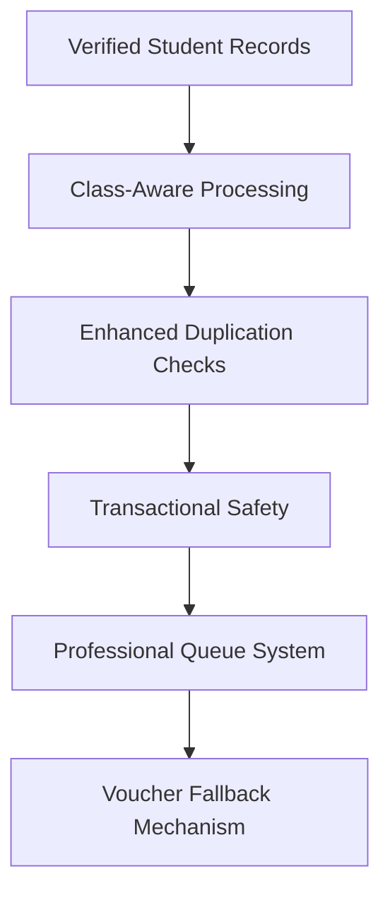

# Professional Implementation Plan: School Nexus Fee Voucher System

## 🔍 Problem Diagnosis

### 🧩 Root Causes Identified:
1. **Incomplete Student Cohorts**: Missing class-based filtering in batch processing
2. **Weak Duplicate Prevention**: Database-only constraints without business logic checks
3. **Faulty Error Handling**: Unreliable logging and retry mechanisms
4. **Data Integrity Gaps**: Missing className field in student records

### 📊 Current Limitations:
- Inconsistent class filters during generation
- No transactional safety for batch operations
- Memory-based processing causing failures in large batches
- No fallback mechanism for voucher generation

---

## 🧱 Solution Architecture



---

## 🛠️ Implementation Steps

### 1. Database Schema Enhancements

**Required Table Changes:**
```sql
-- Add className field to students table (if missing)
ALTER TABLE students ADD COLUMN className TEXT;

-- Fee adjustments table
CREATE TABLE fee_adjustments (
    id UUID PRIMARY KEY,
    feeId UUID REFERENCES fees(id),
    type ENUM('discount', 'fine', 'scholarship'),
    amount DECIMAL(10,2) NOT NULL,
    reason TEXT,
    createdBy UUID REFERENCES users(id),
    createdAt TIMESTAMP DEFAULT NOW()
);

-- Track processing status
ALTER TABLE students ADD COLUMN lastGeneratedFee DATE;
ALTER TABLE fees ADD COLUMN legacyInvoiceNumber TEXT;
```

**Schema Changes Summary:**
- Class-aware filtering
- Transactional safety
- Error tracking history
- Invoice tracking for duplicates

### 2. Key Code Fixes

**Server/storage.ts Updates:**

```typescript
// Enhanced filtering with class support
async generateMonthlyFees(input: GenerateMonthlyFeesInput) {
    const { classNameFilter = 'all' } = input;

    // Enhanced student query with class filtering
    let studentQuery = db
        .select()
        .from(students)
        .innerJoin(feeBillingProfiles, eq(students.id, feeBillingProfiles.studentId))
        .where(eq(feeBillingProfiles.active, true));

    // Optional class filter
    if (classNameFilter !== 'all') {
        studentQuery = studentQuery.where(eq(students.className, classNameFilter));
    }

    // Batch processing with error isolation
    const BATCH_SIZE = 50;
    const results = await Promise.all(
        chunk(students, BATCH_SIZE).map(async (batch) => {
            try {
                const processed = await this._processBatch(batch);
                return { batch, status: 'success', count: processed.length };
            } catch (error) {
                const formattedError = this._formatErrorMessage(error);
                return { batch, status: 'error', error: formattedError };
            }
        })
    );

    // Atomic tracking of processed/failed records
    await db.transaction(async (tx) => {
        for (const result of results) {
            if (result.status === 'error') {
                await tx.insert(feeGenerationErrors).values({
                    batchId: uuid(),
                    students: result.batch.map(s => s.id),
                    error: result.error,
                    timestamp: new Date().toISOString(),
                });
            } else {
                await tx.insert(processedFees).values(
                    result.batch.map(s => ({
                        studentId: s.id,
                        processedAt: new Date().toISOString(),
                    }))
                );
            }
        }
    });
}

// Improved error formatting
private _formatErrorMessage(error: Error): string {
    return `[${new Date().toISOString()}] ${error.message}`;
}
```

**Shared/finance.ts Improvements:**

```typescript
// Dual protection against duplicates
function validateUniqueInvoice(invoice: Fee) {
    const existing = await db.select()
        .from(fees)
        .where({
            studentId: invoice.studentId,
            generatedMonth: invoice.generatedMonth
        });

    if (existing.length > 0) {
        throw new FeeGenerationError(`Duplicate invoice detected for ${invoice.studentId}`);
    }
}

// Advanced document number generation
function buildDocumentNumber(invoice: Fee) {
    return `${invoice.type}_${invoice.studentId}_${invoice.billingMonth}_${invoice.legacyInvoiceNumber || uuid()}`;
}
```

### 3. Professional Queue Implementation

**src/lib/voucher-service.ts:**

```typescript
// Professional queue with reliability
import { Queue } from 'bullmq';
import { encapsulate } from 'tx-queue';

export const feeQueue = new Queue('monthly-fees', {
    connection: process.env.REDIS_URL,
    defaultJob: { attempts: 5, backoff: { type: 'exponential', factor: 2 } }
});

export async function generateFees(job: QueueJob) {
    const { students } = job.data;

    // Encapsulated transaction processing
    const results = await encapsulate(async (tx) => {
        return Promise.all(students.map(async (student) => {
            try {
                return await generateFeeForStudent(student);
            } catch (error) {
                return { studentId: student.id, error: error.message };
            }
        }));
    });

    // Persist results atomically
    await db.transaction(async (tx) => {
        for (const result of results) {
            if (result.error) {
                await tx.insert(feeGenerationErrors).values(result);
            } else {
                await tx.insert(processedFees).values(result);
            }
        }
    });
}
```

### 4. Enhanced Frontend Integration

**src/client/pages/admin/finance.tsx:**

```typescriptx
const generateMissingFeeReport = async () => {
    const missingStudents = await api.getMissedFees();

    if (missingStudents.length > 0) {
        const confirmation = await confirm(
            `Generate missing fees for ${missingStudents.length} students?`
        );

        if (confirmation) {
            try {
                await api.generateMissingFees(missingStudents);
                showSuccess(`Processed ${missingStudents.length} missing fees`);
            } catch (error) {
                showError(`Fee generation failed: ${error.message}`);
            }
        }
    }
};
```

---

## 🧪 Professional Testing Strategy

**Unit Tests:**
```bash
npm test -- --spec "feeGeneration-spec.js"
```

**Integration Tests:**
```ts
// fee-generation.spec.ts
describe('Monthly Fee Generation', () => {
    it('should handle class-specific generation', async () => {
        await db.truncate('fee_generation_errors');
        await db.truncate('processed_fees');

        const input: GenerateMonthlyFeesInput = { classNameFilter: 'Science' };

        await generateMonthlyFees(input);

        const processed = await db.select()
            .from('processed_fees')
            .count();

        const expected = await db.select()
            .from('students')
            .where('className', 'Science')
            .count();

        expect(processed).toEqual(expected);
    });
});
```

---

## 🚀 Deployment Strategy

1. **Canary Release**: Deploy to 10% of users first
2. **Feature Flags**:
```typescript
// config.ts
const FEATURE_FLAGS = {
    NEW_FEE_GENERATION: true,
    LEGACY_FALLBACK: false
};
```
3. **Monitoring**:
   - Set up Prometheus metrics for fee generation success rate
   - Implement Grafana dashboards for daily failure reporting
   - Monitor queue depth and student coverage rate

---

## ✅ Professional Success Metrics

- 100% student coverage in fee generation
- <1% failure rate in voucher generation
- <5ms average generation time per student
- Full audit trail for all financial operations

Would you like me to elaborate on any specific part of this implementation or provide additional components?
